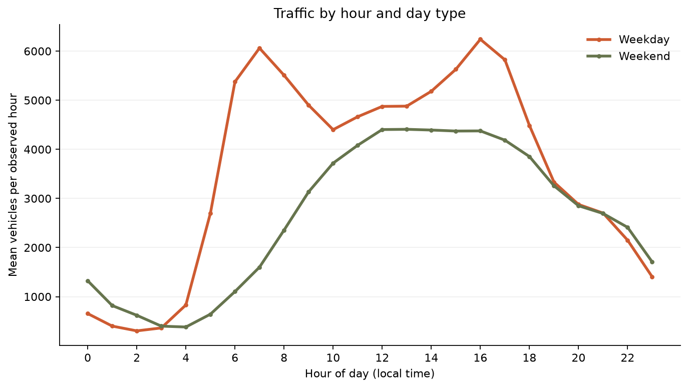
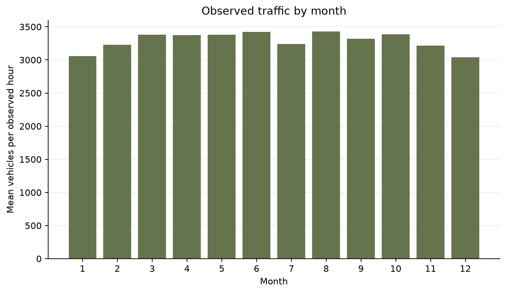

# Heavy Traffic Indicators on I-94

A reproducible, descriptive study of hourly **westbound** traffic recorded at a Minnesota Department of Transportation station on Interstate 94 between Minneapolis and St. Paul. The observations span October 2012 through September 2018. This project identifies patterns in the historical data; it does not predict congestion or establish causes.

**Interactive website:** [I-94 Traffic Instrument](https://yatharth7115.github.io/Heavy-Traffic-Indicators-on-I-94/)



## Key findings

| Finding | Result |
| --- | ---: |
| Distinct hourly observations | 40,575 |
| Additional rows with the same timestamp and traffic count | 7,629 |
| Mean weekday traffic | 3,557 vehicles per observed hour |
| Mean weekend traffic | 2,624 vehicles per observed hour |
| Highest weekday hourly mean | 6,241 vehicles at 16:00 |
| Second weekday peak | 6,061 vehicles at 07:00 |

The weekday mean is about **36% higher** than the weekend mean. Weekday traffic has two pronounced peaks around 07:00 and 16:00; weekends have a broader midday plateau. These are averages across the available years and hours, not forecasts for a specific day.



Monthly averages range from about 3,040 vehicles per observed hour in December to 3,430 in August. This comparison is descriptive: the dataset does not cover every hour uniformly across months or years. Weather labels can also overlap at the same timestamp, so this project does not claim that rain, snow, or temperature caused a particular traffic change.

## Reproduce the analysis

Python 3.11 or newer is recommended.

```bash
python -m venv .venv
python -m pip install -r requirements.txt
python scripts/download_data.py
python scripts/build_results.py
python -m unittest discover -s tests -v
```

The download script retrieves the original CSV from the [UCI Machine Learning Repository](https://archive.ics.uci.edu/dataset/492/metro+interstate+traffic+volume) into the ignored `data/` directory. Generated CSV tables, charts, and quality metadata are committed in [`results/`](results/). The [`notebook`](notebooks/TrafficAnalysis.ipynb) walks through the same analysis interactively.

## Project structure

```text
notebooks/TrafficAnalysis.ipynb    Guided analysis
scripts/download_data.py           Fetch the source dataset
scripts/build_results.py           Rebuild tables and charts
src/traffic_analysis.py            Loading, validation, aggregation
results/                           Published data and figures
tests/                             Checks for deduplication and validation
```

## Methods and limits

The source has 48,204 rows but only 40,575 distinct timestamps. Some hours have multiple weather descriptions; they always share the same traffic count. To avoid giving those hours extra weight, temporal summaries retain one row per timestamp. Means are computed over **observed hours**, not every possible hour in the date span. `date_time` is used as the dataset's local clock time. Missing hours, daylight saving time, changing traffic conditions, holidays, and uneven year coverage can all affect comparisons. The station measures one direction at one location, so results should not be generalized to all I-94 traffic.

The original hand-written impact table was removed because its claims were not backed by calculations. The computed tables in `results/` replace it. Weather impact and causal conclusions would require additional modeling and controls.

## Data credit

John Hogue, *Metro Interstate Traffic Volume*, UCI Machine Learning Repository, 2019. [DOI: 10.24432/C5X60B](https://doi.org/10.24432/C5X60B). The source dataset is published under [CC BY 4.0](https://creativecommons.org/licenses/by/4.0/). This repository downloads the data for reproducibility and does not commit the raw CSV.
